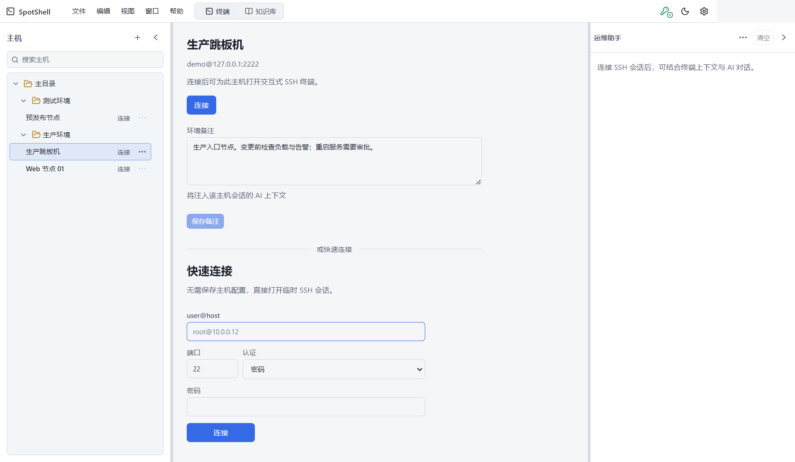
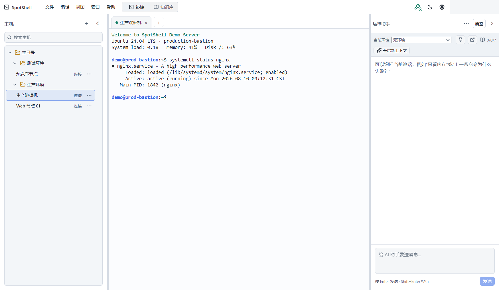
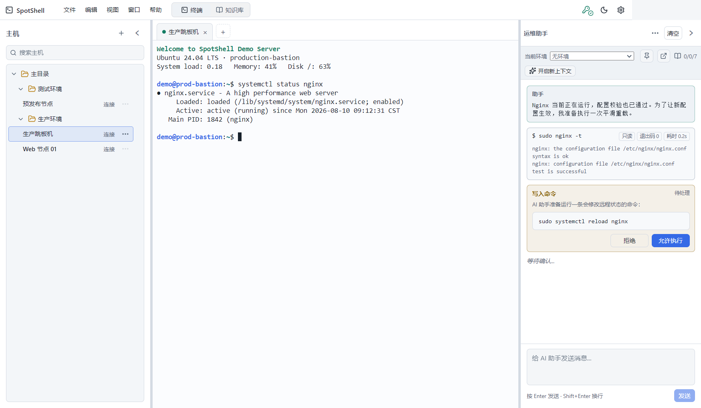

# SpotShell

面向远程运维的 SSH 客户端：在同一个窗口中管理主机、多会话终端、AI 助手与可复用知识。

SpotShell 提供 Windows 桌面端和命令行客户端。桌面端适合日常连接、排障和知识维护；CLI 适合在终端中快速连接，并可用 `Ctrl+O` 切换 SSH 与 AI 模式。

## 功能

| 功能 | 用途 | 详细说明 |
| --- | --- | --- |
| 主机与文件夹 | 保存主机、搜索、分组、拖动整理、测试连接 | [桌面端与按钮](docs/user-guide/desktop.md#主机管理) |
| 多会话终端 | 多标签连接、重连、复制、粘贴、把选中内容交给 AI | [会话与终端](docs/user-guide/desktop.md#会话与终端) |
| AI 运维助手 | 结合当前终端与主机上下文分析问题、生成或执行命令 | [AI 助手](docs/user-guide/ai-assistant.md) |
| 命令审批 | 区分只读、写入和破坏性命令，并按会话策略决定是否确认 | [执行策略](docs/user-guide/ai-assistant.md#执行策略) |
| 环境与知识库 | 管理环境信息、操作指导、参考资料、文件与历史版本 | [环境与知识库](docs/user-guide/knowledge.md) |
| 中英文与主题 | 中文/English、深色/浅色主题、可调整的左右面板 | [顶部栏与设置](docs/user-guide/desktop.md#顶部栏) |

## 界面预览

<table>
  <tr>
    <td width="50%">
      <a href="docs/user-guide/desktop.md#主机管理"></a><br>
      <strong>主机管理</strong><br><sub>搜索、分组、连接测试和主机备注</sub>
    </td>
    <td width="50%">
      <a href="docs/user-guide/desktop.md#会话与终端"></a><br>
      <strong>多会话终端</strong><br><sub>标签页终端与按会话隔离的 AI 上下文</sub>
    </td>
  </tr>
  <tr>
    <td width="50%">
      <a href="docs/user-guide/ai-assistant.md#执行策略"></a><br>
      <strong>AI 命令审批</strong><br><sub>检查命令、风险与执行结果后再决定是否允许</sub>
    </td>
    <td width="50%">
      <a href="docs/user-guide/knowledge.md"></a><br>
      <strong>环境与知识库</strong><br><sub>结构化编辑、关联、发布和历史版本</sub>
    </td>
  </tr>
</table>

## 安装

从 [GitHub Releases](../../releases/tag/v1.0.0) 下载 Windows x64 版本：

| 文件 | 适用场景 |
| --- | --- |
| `SpotShell 1.0.0.exe` | 便携版，双击即用，不需要安装 |
| `SpotShell Setup 1.0.0.exe` | 安装版，可选择目录并创建开始菜单与卸载入口 |

桌面数据保存在当前用户的 `%APPDATA%\SpotShell\`。卸载应用不会自动删除这里的主机、设置和知识数据。

## 快速开始

1. 启动 SpotShell，点击左侧 `+` 添加主机，填写地址、端口、用户名和认证方式。
2. 点击 `连接`。首次连接时核对并接受服务器指纹。
3. 如需 AI，打开右上角 `设置`，填写 API Key、Base URL 和模型，再点击 `测试连接`。
4. 在右侧 AI 面板提问；AI 请求执行写入或危险命令时，先检查审批卡片再决定是否允许。

更完整的首次配置和每个按钮的作用见 [桌面端使用指南](docs/user-guide/desktop.md)。

## 从源码运行

需要 Node.js 18 或更高版本。

```bash
npm install
npm run dev:desktop
```

运行 CLI：

```bash
npm run dev:cli -- root@192.168.1.10 -p 22
```

常用 CLI 参数：

```text
-p, --port <port>       SSH 端口，默认 22
-i, --identity <file>   私钥文件路径
-P, --password          强制使用密码认证
-v, --verbose           输出详细日志
```

CLI 从环境变量或根目录 `.env` 读取 AI 配置：

```dotenv
OPENAI_API_KEY=
OPENAI_BASE_URL=
OPENAI_MODEL=gpt-4o-mini
```

连接后按 `Ctrl+O` 切换直接终端与 Agent 模式。Agent 模式支持 `help`、`clear`、`context` 和 `exit`。

## 构建与测试

```bash
npm run build
npm test
npm run pack -w @spotshell/desktop
```

Windows 安装包输出到 `packages/desktop/release/`。

## 项目结构

| 目录 | 内容 |
| --- | --- |
| `packages/core` | SSH、命令风险判断、AI Agent 与知识逻辑 |
| `packages/cli` | 命令行客户端 |
| `packages/desktop` | Electron 桌面端 |
| `docs/user-guide` | 用户指南 |
| `docs/decisions` | 关键设计决策 |

## 安全说明

- 首次连接使用服务器指纹确认，后续连接会校验已信任的指纹。
- 正式打包版使用操作系统安全存储加密 API Key；安全存储不可用时拒绝保存明文 Key。
- AI 的命令执行受当前会话策略控制，破坏性命令不会因“自动执行”策略而跳过确认。
- 不要把 `.env`、私钥、密码、主机数据或 `%APPDATA%\SpotShell\` 中的文件提交到仓库。
