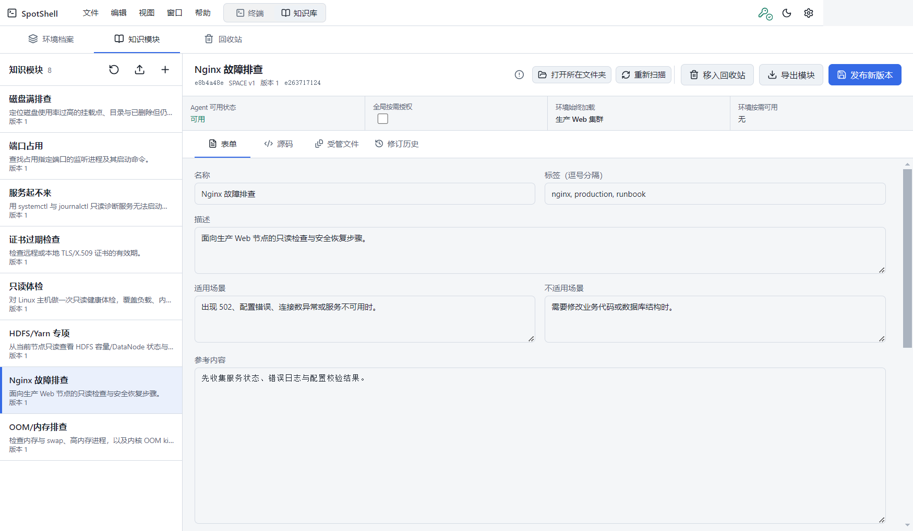

# 环境与知识库指南

点击顶部 `知识库` 进入独立的管理工作区。这里的数据用于构建 AI 上下文，不会自动在远程主机上执行命令。

## 三个区域

| 区域 | 管理内容 |
| --- | --- |
| 环境配置 | 某类服务器或场景的事实，以及应固定或按需使用的知识模块 |
| 知识模块 | 可复用的参考资料、适用条件和操作指导 |
| 回收站 | 恢复软删除项目、永久删除或清理已过期项目 |

## 环境配置

环境用于描述生产、测试、数据库等运行场景。主机可以绑定一个默认环境，会话中也可以临时切换。

| 操作或页签 | 作用 |
| --- | --- |
| `+` | 新建环境 |
| 导入 | 从文件导入环境定义或自包含包 |
| 导出 | 导出定义；自包含包会连同关联知识一起导出 |
| 删除 | 预览引用后移入回收站；仍绑定主机时会阻止删除 |
| 发布 | 校验草稿并创建一个不可变的新版本 |
| 表单 | 编辑名称、描述、标签和环境事实 |
| 源码 | 直接编辑环境源文本 |
| 关联 | 设置知识模块的顺序和加载方式 |
| 文件 | 管理环境附带的文本文件 |
| 历史 | 查看、比较和恢复历史版本 |

环境中的知识关联有两种：

- `始终加载`：每次使用该环境时都进入上下文，适合关键约束和固定流程。
- `按需加载`：成为可用候选，由用户或 Agent 在需要时加载。

导入发生同 ID 冲突时，可以保留本地版本、使用导入版本或作为副本导入。应逐项处理环境和知识模块冲突后再确认。

## 知识模块

知识模块适合保存诊断手册、命令说明、限制条件和团队约定。

| 操作或页签 | 作用 |
| --- | --- |
| `+` | 新建知识模块 |
| 导入 / 导出 | 在本地文件与 SpotShell 之间迁移模块 |
| 删除 | 检查环境引用后移入回收站 |
| 发布 | 将已自动保存的草稿创建为新版本 |
| 表单 | 编辑名称、标签、描述、适用/不适用条件、参考正文和 Guidance |
| 源码 | 直接编辑模块源文本 |
| 文件 | 新建、粘贴或导入文本文件，并管理 Guidance 文件登记 |
| 历史 | 查看旧版本并恢复为新草稿 |

草稿会自动保存，但只有点击 `发布` 才会产生可供会话选择的新版本。源文本不符合结构或包含疑似秘密时，界面会提示并阻止不安全的使用路径。

### 文件管理按钮

| 按钮 | 作用 |
| --- | --- |
| 新建 | 创建托管文本文件 |
| 导入 | 从本机导入支持的文本文件 |
| 粘贴 | 将剪贴板文本保存为文件 |
| 保存 | 保存当前文件内容 |
| 从来源更新 | 比较外部来源文件，确认后采用更新 |
| 登记/取消 Guidance | 决定该文件是否作为操作指导进入上下文 |
| 重命名 | 修改托管路径 |
| 删除 | 删除当前托管文件，需要二次确认 |

外部文件变化不会直接覆盖已发布知识。SpotShell 会先显示变化，采用后再由用户发布新版本。

## 回收站

删除环境或知识模块时先进入回收站。列表会显示项目类型和保留期限。

| 操作 | 作用 |
| --- | --- |
| 恢复 | 将项目恢复到原管理区 |
| 永久删除 | 二次确认后不可恢复地删除项目 |
| 清理过期项 | 批量永久删除超过保留期限的项目 |

永久删除前应确认不再需要其历史版本和文件。仍被其他对象引用的项目会显示关联信息，便于先解除关系。

## 推荐工作流

1. 创建知识模块，填写适用条件、参考内容和 Guidance，然后发布。
2. 创建环境，把关键模块设为始终加载，其余设为按需加载，然后发布。
3. 在主机编辑器中绑定默认环境，或在会话 AI 面板中临时选择。
4. 知识更新后发布新版本，在正在使用的会话中明确选择 `应用新版` 或 `保留当前`。

返回 [README](../../README.md) · 继续阅读 [桌面端与按钮](desktop.md) · [AI 助手](ai-assistant.md)
